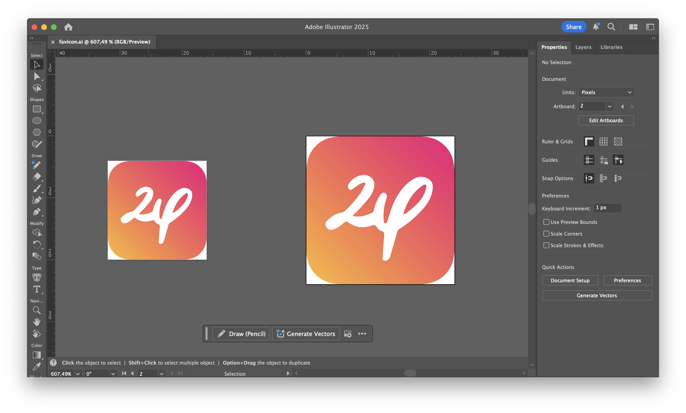
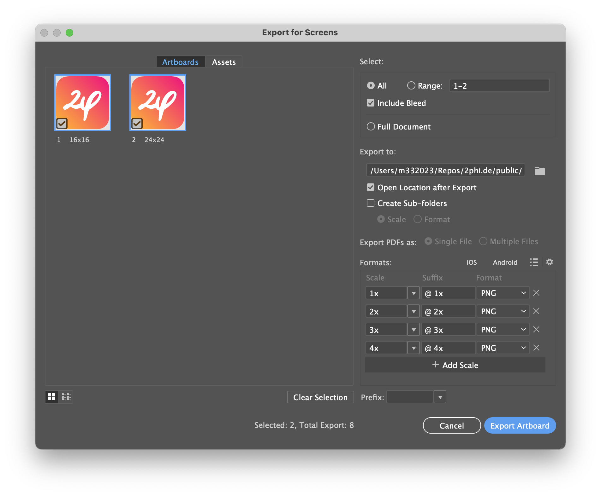

# Favicon generation

## Option 1: Online favicon genetration (automatic and preferred)

Read [this guide](https://dev.to/masakudamatsu/favicon-nightmare-how-to-maintain-sanity-3al7) and use [RealFaviconGenerator](https://realfavicongenerator.net).


## Option 2: Favicon generation with Adobe Illustrator (manual)

We’re going to assume for this guide that you want the following sizes in your ICO: 16, 24, 32, 48, 64, 96.


### Step 1: Create a template file

You’ll want two artboards; one at 16x16 and the other at 24x24. We do this to try to avoid sub-pixelation as much as possible when expanding to the larger sizes.




### Step 2: Export the artboards

Go to File > Export > For Screens or use the keyboard shortcut ⌥+⌘+E. In this next screen you want to export both artboards as PNGs at 1x, 2x, 3x, and 4x scale. After the export you can delete the 72px icon (24px @ 3x scale) and pick which 48px icon you want to keep (16px @ 3x or 24px @ 2x scale). You can now skip ahead to the Converting section down below.




### Step 3: Create the ico file

Install ImageMagick and create the ICO file:

```sh
magick 2phi_16x16.png 2phi_24x24.png 2phi_32x32.png 2phi_48x48.png 2phi_64x64.png 2phi_96x96.png 2phi_favicon.ico
```

